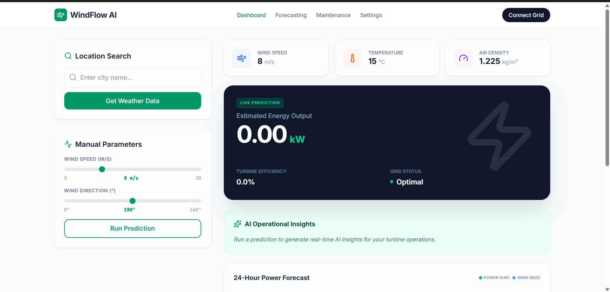
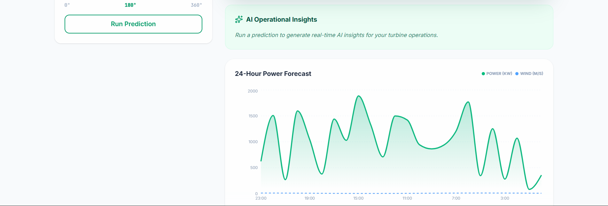

# 🌬️ WindFlow AI — Wind Turbine Energy Prediction System

<p align="center">


</p>

---

# 🚀 Project Overview

⚡ **WindFlow AI** is an intelligent system that predicts **wind turbine energy output using weather conditions**.

The system integrates **machine learning models, real-time weather data, and an interactive Flask dashboard** to provide insights for renewable energy optimization.

💡 The goal is to help **energy companies, grid operators, and wind farm managers** forecast energy production and improve turbine efficiency.

---

# 🎯 Key Features

✨ **AI-powered Energy Prediction**
🌦 **Weather Data Integration (API)**
📊 **24-Hour Power Forecast Visualization**
⚡ **Operational Insights Dashboard**
🌍 **Real-time Renewable Energy Monitoring**

---

# 🖥️ Application Dashboard

## 🌬️ WindFlow AI Interface



---

## 📊 Power Forecast Visualization



---

# 🧠 System Architecture

```
User Inputs Weather Data
        │
        ▼
Flask Web Application
        │
        ▼
Machine Learning Model
        │
        ▼
Energy Output Prediction
        │
        ▼
Interactive Dashboard Visualization
```

---

# 🛠️ Tech Stack

| Technology                  | Usage                   |
| --------------------------- | ----------------------- |
| 🐍 **Python**               | Core programming        |
| 🌐 **Flask**                | Web application         |
| 📊 **Pandas & NumPy**       | Data preprocessing      |
| 📈 **Matplotlib & Seaborn** | Data visualization      |
| 🤖 **Scikit-Learn**         | Machine learning models |
| 🌦 **OpenWeather API**      | Real-time weather data  |

---

# 📂 Project Structure

```
Flask-Wind-Mill-Power-Prediction
│
├── data
│   └── wind_data.csv
│
├── static
│   └── images
│
├── templates
│   ├── index.html
│   └── result.html
│
├── app.py
├── windApp.py
├── train_model.py
├── power_prediction.sav
└── README.md
```

---

# 📊 Dataset

Dataset used in this project:

🔗 https://www.kaggle.com/datasets/berkerisen/wind-turbine-scada-dataset

Dataset contains key parameters such as:

* Wind Speed
* Wind Direction
* Temperature
* Air Density
* Generated Power Output

---

# 🤖 Machine Learning Models

Algorithms explored in this project:

✔ Linear Regression
✔ Decision Tree Regression
✔ Random Forest Regression

🏆 **Best Performing Model:** Random Forest Regressor

Evaluation Metric:

* **R² Score**

---

# ⚙️ Installation Guide

### 1️⃣ Clone Repository

```bash
git clone https://github.com/yourusername/windflow-ai-energy-prediction.git
```

### 2️⃣ Navigate to Project

```bash
cd windflow-ai-energy-prediction
```

### 3️⃣ Install Dependencies

```bash
pip install -r requirements.txt
```

### 4️⃣ Run Flask App

```bash
python app.py
```

### 5️⃣ Open Browser

```
http://127.0.0.1:5000
```

---

# 🌍 Real-World Applications

⚡ Wind Farm Energy Forecasting
🔧 Turbine Maintenance Scheduling
🔌 Smart Grid Integration
🌱 Renewable Energy Optimization

---

# 📈 Future Enhancements

🚀 Deep Learning Energy Forecasting (LSTM)
☁️ Cloud Deployment (AWS / GCP)
📡 IoT Wind Turbine Monitoring
📊 Advanced Energy Analytics Dashboard

---

# 👨‍💻 Author

**Satya Kumar Kottapalli**

🎓 AI & Data Science Enthusiast
⚡ Passionate about Machine Learning and Renewable Energy Systems

---

# ⭐ Support

If you like this project, please **give it a star ⭐ on GitHub**!

It helps others discover the project and motivates further improvements.
